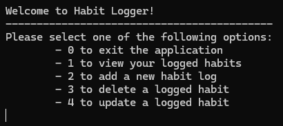
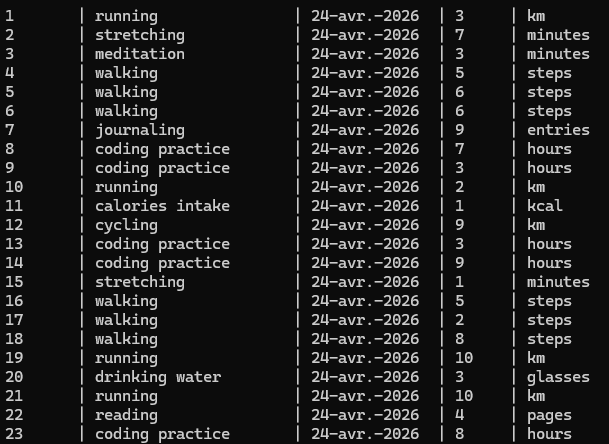

# Habit Logger

My first C# application using SQLite and Unit testing.

Console based CRUD application to track occurrences of different habits. Developed using C#, SQLite and NUnit.

## Given Requirements
  - This is an application where you'll log occurrences of a habit.
  - This habit can't be tracked by time (ex. hours of sleep), only by quantity (ex. number of water glasses a day).
  - Users need to be able to input the date of the occurrence of the habit.
  - The application should store and retrieve data from a real database.
  - When the application starts, it should create a SQLite database, if one isn't present.
  - It should also create a table in the database, where the habit will be logged.
  - The users should be able to insert, delete, update and view their logged habit.
  - You should handle all possible errors so that the application never crashes.
  - You can only interact with the database using ADO.NET. You can't use mappers such as Entity Framework or Dapper.
  - Follow the DRY Principle, and avoid code repetition.
  - Your project needs to contain a Read Me file where you'll explain how your app works and tell a little about your thought progress.

## Optional Challenging Requirements
  - If you already have a bit of experience with programming, we highly recommend you get into the habit of writing unit tests for a few methods in your project. Any method that outputs data and doesn't talk to a database can be unit tested.
  - If you haven't, try using parameterized queries to make your application more secure.
  - Let the users create their own habits to track. That will require that you let them choose the unit of measurement of each habit.
  - Seed Data into the database automatically when the database gets created for the first time, generating a few habits and inserting a hundred records with randomly generated values.

## Features
  - SQLite database connection
    -- The program uses a SQLite db connection to store and read information.
    -- If no database exists, or the correct table does not exist they will be created with random data on program start.
  - A console based UI where users can navigate by entering options.
  
  - CRUD DB functions
    -- From the main menu users can Create, Read, Update or Delete entries for whichever habit they want. They need to enter the habit name, the date (format : dd-MMM-yyyy or "t" to automatically input today's date), quantity and unit.
    -- User input are automatically checked to make sure they are in the correct and realistic format.
  - Registered Habit output
  

## How to run it

### Prerequisites

- [.NET SDK](https://dotnet.microsoft.com/download) 10.0 or later

### Steps

```bash
git clone https://github.com/Sephydev/STUDY.CSharp.HabbitLogger.git
cd STUDY.CSharp.HabbitLogger/HabbitLogger
dotnet run
```

## Challenges
  - It was my first time using SQLite with C#. I had to watch the video tutorial once to at least know where to start. Thanks to the video, I learned about Microsoft.Data.SQlite, and with that, I checked the official documentation each time I needed.
  - Implementing the DRY principle with this project while keeping the KISS and SRP principle in this project, without using classes was a bit overwhelming. I needed to take a break a few days to have a clear mind to continue.
  - It was also my first time implementing Unit Test. I also had to watch the video tutorial and read the article given by C# Academy. I modified the code given by the video so it can work perfectly in my code.

## Lesson Learned
  - Always read carefully the documentation. I've got a SQL error while creating the table because of this line I took from the documentation : `CREATE TABLE IF NOT EXISTS habits.table_name`. The error was caused by the `.table_name` part of the line. I removed it.
  - Trying to keep a readable code by implementing DRY, KISS and SRP principle is hard without classes. I didn't want to use class to focus on the new topics of this project (SQL and Unit Test), and use it for the next project. It was hard but I managed to overcome it.
  - Unit Test needs tested method to be in a class other than Program to works. I've got an error when I started to implement Unit Test, saying that the test cannot find the method I wanted to test. To solve this, I created a `public static class ValidationHelper` class and refactor the main code to resolve potential bugs.

## Areas to improve
  - I need to get better with DRY, KISS and SRP principle. I have a feeling that my actual code can be better, notably with the repeated code for the connection to the db. I think I don't have the knowledge to solve this yet, but I'm sure that doing projects and with practice I can be better.

## Resources Used
  - C# Academy for the specs and related articles : https://www.thecsharpacademy.com/project/12/habit-logger
  - SQLitetutorial to learn the basic SQL command : https://www.sqlitetutorial.net/
  - Microsoft.Data.Sqlite official documentation to learn basic usage of it: https://learn.microsoft.com/en-us/dotnet/standard/data/sqlite/?tabs=net-cli 
